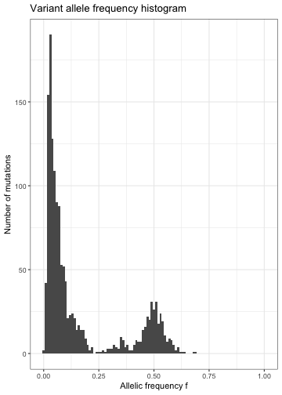
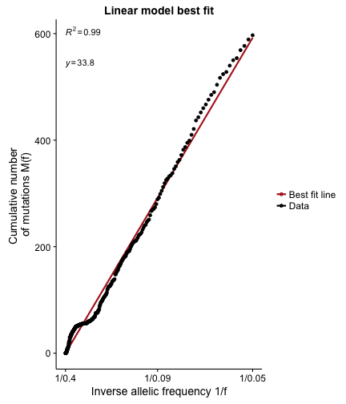
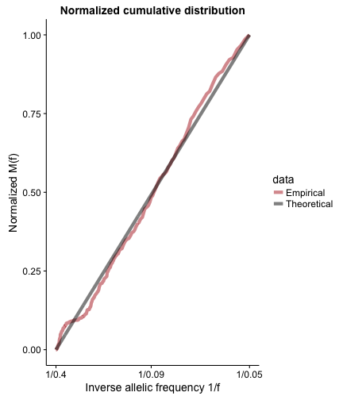

## Load package

To load the package content run the script `TestingNeutrality.R`. This will load all functions and some testdata files. Make sure that you have installed the following required packages: `pracma`, `ggplot2`, `scales` and `dplyr`. First of all set the directory to the package directory.


```r
setwd(packagedir)
source("R/TestingNeutrality.R")
```

The test data files include 2 simulated VAF distributions, one under a neutral evolutionary model and one with a non neutral evolutionary model. The test data are vectors of variant allele frequency, and are named VAFselection and VAFneutral. First of all we print the first few elements of one of these vectors.


```r
head(VAFselection)
```

```
## [1] 0.5250000 0.5104895 0.4703947 0.4726027 0.4345048 0.5136054
```

## `neutralitytest` object

The basic functionality of the TestingNeutrality.R package is achieved by creating a `neutralitytest` object. The `neutralitytest` object contains a range of metrics to test for neutrality, and makes plotting histograms and cumulative distributions to visualize the output easy. The neutralitytest function takes a vector of VAFs and an upper and lower limit for the frequency range over which we wish to test whether the data is consistent with a neutral model, and then calculates all 4 metrics.


```r
s <- neutralitytest(VAFselection, fmin = 0.05, fmax = 0.4)
```
We can the print a summary of the neutralitytest object for the synthetic data with selection. This prints out all values and associated p-values for all the metrics. The p-values are the p-values under the null model of neutral evolution.


```r
summary(s)
```

```
## Summary of neutrality metrics: 
## 
## Area:
##   value =  0.1542382 , p-value =  0.039 
## Kolmogorov Distance:
##   value =  0.3450728 , p-value =  0.006 
## Mean distance:
##   value =  0.1839998 , p-value =  0.013 
## R^2:
##   value =  0.8347292 , p-value =  0.001 
## 
## Effective mutation rate =  43.61309
```
And we can do the same for the neutral synthetic data.

```r
n <- neutralitytest(VAFneutral,fmin = 0.05, fmax = 0.4)
summary(n)
```

```
## Summary of neutrality metrics: 
## 
## Area:
##   value =  0.001196022 , p-value =  0.988 
## Kolmogorov Distance:
##   value =  0.04412539 , p-value =  0.953 
## Mean distance:
##   value =  0.01950672 , p-value =  0.906 
## R^2:
##   value =  0.9941321 , p-value =  0.585 
## 
## Effective mutation rate =  33.84608
```

## Plotting

The `neutralitytest` object makes plotting simple. First of all we can plot a histogram of the VAFs.


```r
vaf_histogram(n)
```



We can also plot the cumulative distribution along with the least squares best fit line, from which we get the $R^2$ value and the estimated mutation rate.


```r
lsq_plot(n)
```



And finally the normalized cumulative distribution, which is used to calculate the kolmogorov distance and the area metrics.

```r
normalized_plot(n)
```



Invoking the plot command will plot all 3 plots together.

```r
plot_all(s)
```

```
## Error in eval(expr, envir, enclos): could not find function "plot_all"
```

## Summary of neutrality metrics
`TestingNeutrality.R` calculates values for 4 from which we can deduce whether a given dataset is likely to be driven by a neutral evolutionary process or not. These metrics are all based the cumulative distributions of mutations, M(f), which under a neutral model follows the following equation:
\begin{equation}
M(f) = \frac{\mu}{\beta} \left (\frac{1}{f} - \frac{1}{f_{max}} \right)
\end{equation}
where $f$ is the frequency of mutations, $\mu$ is the mutation rate, $\beta$ is the proportion of divisions that results in 2 surviving offspring and $f_{max}$ is the maximum frequency over which we conduct the analysis. The first metric we calculate is the $R^2$ value from the best fit line of the linear model described by equation (1).

The other metrics are based on a normalized version of equation (1) which removes the mutation rate dependency. The equation for the normalized $M(f)$ is
\begin{equation}
M(f) = \frac{\frac{1}{f}-\frac{1}{f_{max}}} {\frac{1}{f_{min}} - \frac{1}{f_{max}}}
\end{equation}
Theoretically, any dataset can be compared to the curve described by equation (2). We can then calculate the area between the data and this curve, the kolmogorov distance between the two and the mean distance of all points and this curve. For further details on the theoretical background see _Williams, Werner et al. Nat. Gen. 2016._
